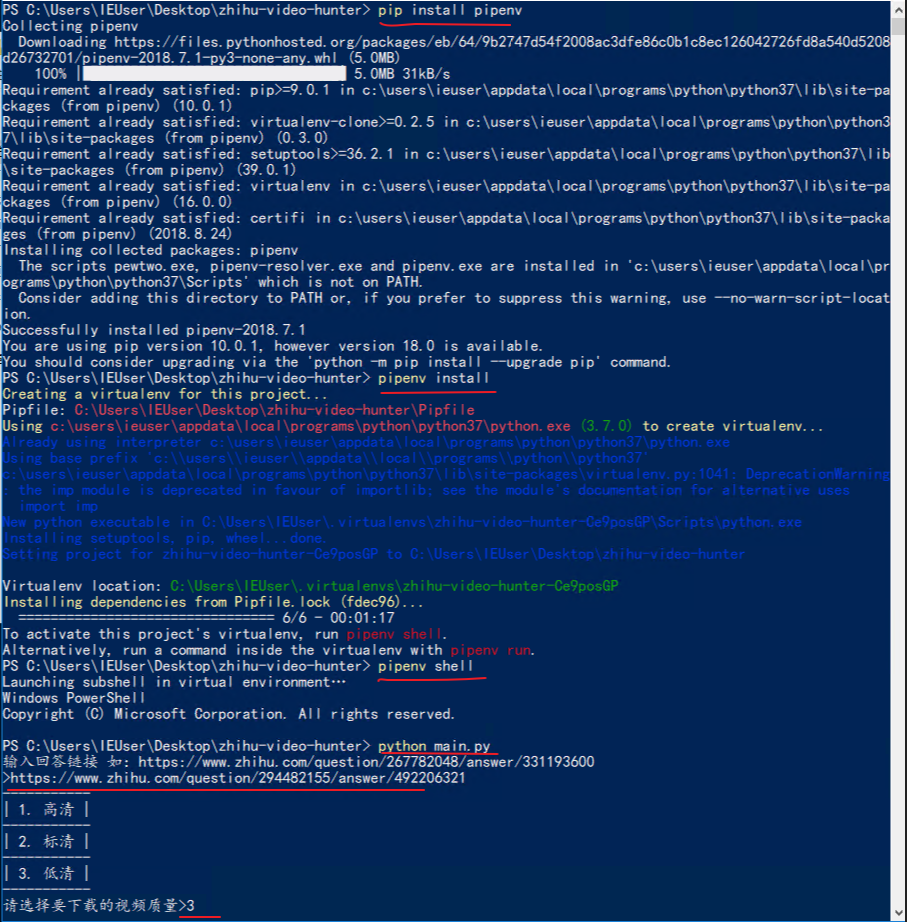

# zhihu-video-hunter
知乎回答视频下载。目前能下载问答中回答和专栏文章中的视频，不能下载问题中的视频。回答链接通过具体回答中的分享可以获得。

下载到的视频存放在工程目录下面


## 用法

下载功能依赖 ffmpeg [下载之](https://www.ffmpeg.org/download.html) ，将ffmpeg所在的目录加入到环境变量 path 中

首先 cd 到 工程目录

### 安装 pipenv （已安装则跳过）
在非虚拟环境下安装
```
pip install pipenv
```

### 创建虚拟环境以及安装依赖

```
pipenv install
```
### 进入pipenv shell
```
pipenv shell
```
### 执行代码
```
python main.py
```

